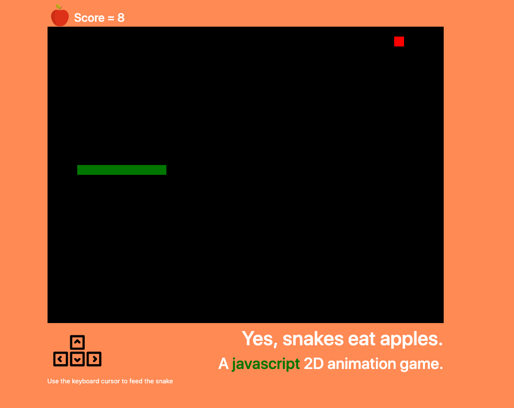

# Snake Game (Vanilla Javascript)

2D game where the object is to use your keyboard scroll arrows and guide the snake to eat the fruit and collect enough snake pieces to have the snake's head hit it's tale.Watch out for the edge of the canvas or when running into your snake while navigating!  Watch your pieces grow while the game keeps score. For a living running version go [HERE](https://ram071985.github.io/snake-game/) 

## Summary

I wanted to create this game to increase my knowledge of javascript and take me to the outer limits of my comfort zone.The snake game utilizes html canvas to provide the layout and playing area for the snake and fruit to move.I was able to gain a lot more confidence in using loops to sift though the array parts that make up each part of the snake.The logic behind the snake moving like links in a chain was the most challenging aspect of the game to figure out for me.I'm very excited to have this 2D game as part of my skill sets in software development.  I would love to keep building more games in the future!  

## Features
- Game moves with keyboard arrows(right,left,up,down)
- As snake grows larger, it moves like links in a chain
- When snake hits wall game starts over
- When snake hits itself in navigation game starts over
- You're a winner when snake head connects with tale!

## Author 

* **Reid Muchow** - *Front-End Software Developer* - [Website](https://www.reidmuchow.com) | [LinkedIn](https://www.linkedin.com/in/reidmuchow/)

